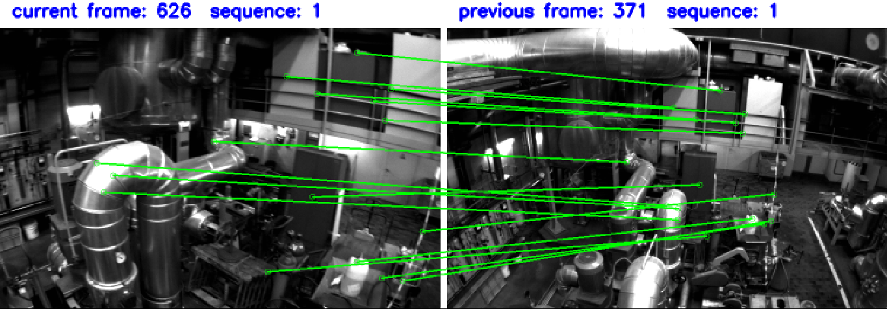

# This project is based on VINS-FUSION. I've merged superpoint、lightglue and MixVPR into VINS-FUSION for loop closure. The README and code will be updated soon!
### 仅供学习使用 | For study use only
## NOTE: There is a fatal bug in the previous version of this project and if u have copied the previous version of this project,dont waste ur time to try anything. Please refer to the coming code and i will try my best to make it easy to use.
### 1、Env
python==3.8.18

onnx==1.13.1

onnxruntime==1.16.3

torch==1.13.1+cu117

cuda == 11.7

TensorRT == 8.6.1.6

faiss == 1.7.2

opencv == 3.4.10 

2070 SUPER

### 2、Build Vins-Fusion
please refer to [Vins-Fusion](https://github.com/HKUST-Aerial-Robotics/VINS-Fusion)


### 3、export onnx

- mixvpr

```python
    model = VPRModel(backbone_arch='resnet50',
                     layers_to_crop=[4],
                     agg_arch='MixVPR',
                     agg_config={'in_channels': 1024,
                                 'in_h': 20,
                                 'in_w': 20,
                                 'out_channels': 256,
                                 'mix_depth': 4,
                                 'mlp_ratio': 1,
                                 'out_rows': 2},
                     )

    state_dict = torch.load('/home/sy/sy/Mix_ws/src/mixvpr/model/resnet50_MixVPR_512_channels(256)_rows(2).ckpt')
    model.load_state_dict(state_dict)
    model.eval()
    model.cpu()

    input = torch.randn(1, 3, 320, 320)
    output_path = '/home/sy/sy/Mix_ws/src/mixvpr/mix_512.onnx'

    torch.onnx.export(model, input, output_path,
                      verbose=False,
                      opset_version=13,
                      input_names=['img'],
                      output_names=['des'],
                      )

    model_sim, flag = onnxsim.simplify(output_path)
    if flag:
        onnx.save(model_sim, output_path)
        print("---------simplify onnx successfully---------")
    else:
        print("---------simplify onnx failed-----------")
```

- SP + LG

1、Download the weights from here  [superpoint_weights](https://github.com/cvg/LightGlue/releases/download/v0.1_arxiv/superpoint_v1.pth)

2、Follow the guidence of [lightglue-ONNX](https://github.com/fabio-sim/LightGlue-ONNX) to export SP and LG onnx, and I suggest you to export with my params if you dont want to change any codes.

```
--dynamic
--extractor_type=superpoint
--extractor_path=YOUR_SP_ONNX_PATH
--lightglue_path=YOUR_LG_ONNX_PATH
--max_num_keypoints=YOUR_NUM / MY_NUM = 512
```

example :

```python
if __name__ == "__main__":
    #generate onnx model
    args = parse_args()
    export_onnx(**vars(args))

    #simplify your onnx model
	#replace it with your exsited onnx path
    output_path_sp=('/home/sy/sy/Mix_ws/src/mixvpr/model/sp+sg/superpoint_512_new.onnx')

    print('----------start simplifying sp-----------')
    model_sim, flag = onnxsim.simplify(output_path_sp)
    if flag:
        onnx.save(model_sim, output_path_sp)
        print("---------simplify sp successfully---------")
    else:
        print("---------simplify sp failed-----------")
        
    #simplify your onnx model
	#replace it with your exsited onnx path
    output_path_lg=('/home/sy/sy/Mix_ws/src/mixvpr/model/sp+sg/superpoint_512_new.onnx')

    print('----------start simplifying lg-----------')
    model_sim, flag = onnxsim.simplify(output_path_lg)
    if flag:
        onnx.save(model_sim, output_path_lg)
        print("---------simplify lg successfully---------")
    else:
        print("---------simplify lg failed-----------")
```


- SP_RECOVER

1、Download the weights from here  [superpoint_weights](https://github.com/cvg/LightGlue/releases/download/v0.1_arxiv/superpoint_v1.pth)

2、see ultrapoint.py and follow the example

```python
if __name__ == "__main__":
    model = ultrapoint.UltraPoint().eval()
    model.cpu()
    # 确定好网络输入和输出路径
    #input img_size
    image = torch.randn(1, 1, 480, 752)
    #input kpts.size
    keypoints = torch.randn(1, 512, 2)
    #replace it with yopur path
    output_path = '/home/sy/sy/Mix_ws/src/mixvpr/model/superpoint_recover_des_480x752.onnx'

    # 载入模型，输入、opset版本以及输入输出的名字
    # options
    torch.onnx.export(model,
                      (image,keypoints),
                      output_path,
                      verbose=False,
                      opset_version=17,
                      input_names=["image_r","keypoints_r"],
                      output_names=["scores_r","des_r"],
                      dynamic_axes={
                          "keypoints_r": {1: "num_keypoints"},
                          "des_r": {1: "num_keypoints"},
                          "scores_r": {0: "num_keypoints"},
                      }
                      )
    # 模型简化 simplify your model
    model_sim, flag = onnxsim.simplify(output_path)
    if flag:
        onnx.save(model_sim, output_path)
        print("---------simplify sp_re successfully---------")
    else:
        print("---------simplify sp_re failed-----------")
        
```


### 4、将onnx转成engine文件 / transform onnx to .engine

Example:

trtexec --onnx='/home/sy/sy/Mix_ws/src/mixvpr/model/sim_800x400_512/superpoint_512.onnx'  --fp16 --minShapes=image:1x1x400x800 --optShapes=image:1x1x400x800 --maxShapes=image:1x1x400x800  --saveEngine=/home/sy/sy/Mix_ws/src/mixvpr/model/sim_800x400_512/superpoint_800x400_512.engine --warmUp=500 --duration=10

```
//SP
trtexec --onnx='/home/sy/sy/Mix_ws/src/mixvpr/model/sim_752x480_512/superpoint_512.onnx'  --fp16 --minShapes=image:1x1x480x752 --optShapes=image:1x1x480x752 --maxShapes=image:1x1x480x752  --saveEngine=/home/sy/sy/Mix_ws/src/mixvpr/model/sim_752x480_512/superpoint_752x480_512.engine --warmUp=500 --duration=10


//LG
trtexec --onnx='/home/sy/sy/lightglue_ws/src/LightGlue-ONNX/weights/my/sim_752x480_1024/superpoint_lightglue.onnx'  --fp16 --saveEngine='/home/sy/sy/Mix_ws/src/mixvpr/model/sim_752x480_1024/superpoint_lightglue_10_1024.engine' --warmUp=500 --duration=10 --minShapes=kpts0:1x10x2,kpts1:1x10x2,desc0:1x10x256,desc1:1x10x256 --optShapes=kpts0:1x512x2,kpts1:1x512x2,desc0:1x512x256,desc1:1x512x256  --maxShapes=kpts0:1x1024x2,kpts1:1x1024x2,desc0:1x1024x256,desc1:1x1024x256


//SP_RE
trtexec --onnx='/home/sy/sy/Mix_ws/src/mixvpr/model/sp_re_752x480_512/superpoint_recover_des_480x752.onnx'  --fp16 --saveEngine='/home/sy/sy/Mix_ws/src/mixvpr/model/sp_re_752x480_512/superpoint_recover_des_480x752.engine' --warmUp=500 --duration=10 --minShapes=keypoints_r:1x20x2  --optShapes=keypoints_r:1x150x2  --maxShapes=keypoints_r:1x512x2


//mixvpr
trtexec --onnx='/home/sy/sy/Mix_ws/src/mixvpr/model/mix1.onnx'  --fp16 --saveEngine=mix1.engine --warmUp=500 --duration=10 
```

## 5、performance in some datasets(EuRoC, KAIST urban, 4Seasons)

### matching examples




| image size                                | 752*480(euroc) | 800*400(4seasons) | 1280*560(KAIST urban) |
| ----------------------------------------- | -------------- | ----------------- | --------------------- |
| Global Feature Extraction (ms)            | 1.5            | 2                 | 2.3                   |
| Keyframe Retrival (ms)                    | 0.8            | 2.2               | 1.7                   |
| Local Feature Extraction(512 points) (ms) | 6.1            | 5.4               | 10.3                  |
| Local Feature Matching (ms)               | 4.1            | 4.1               | 3.8                   |
| Total Time cost (ms)                      | 12.5           | 13.7              | 18.1                  |
| Total Memory cost (MB)                    | 422            | 400               | 600                   |


## 6、TODO

- [ ] Replace some functions in this project with kernal function if possible.

## 7、 Acknowledgements
This project is based on [Vins-Fusion](https://github.com/HKUST-Aerial-Robotics/VINS-Fusion)

We use [ceres solver](http://ceres-solver.org/) for non-linear optimization, a generic [camera model](https://github.com/hengli/camodocal) and [GeographicLib](https://geographiclib.sourceforge.io/).

I use [superpoint](https://github.com/rpautrat/SuperPoint) 、[lightglue](https://github.com/cvg/LightGlue)、[MixVPR](https://github.com/amaralibey/MixVPR) for loop closure,and the part of TensorRT infrence is based on [Linfer](https://github.com/l-sf/Linfer)

## 8、 License
The source code is released under [GPLv3](http://www.gnu.org/licenses/) license.
